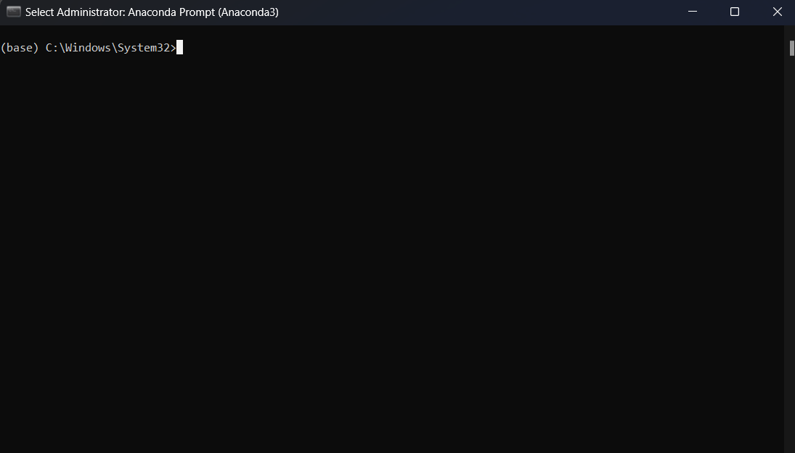
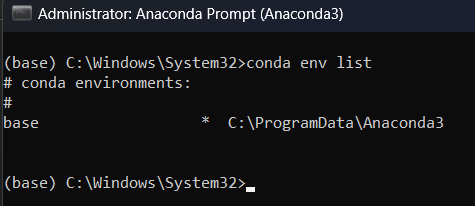
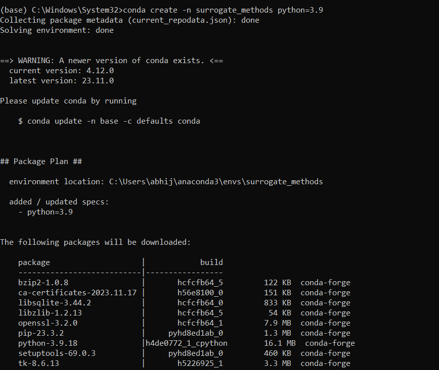
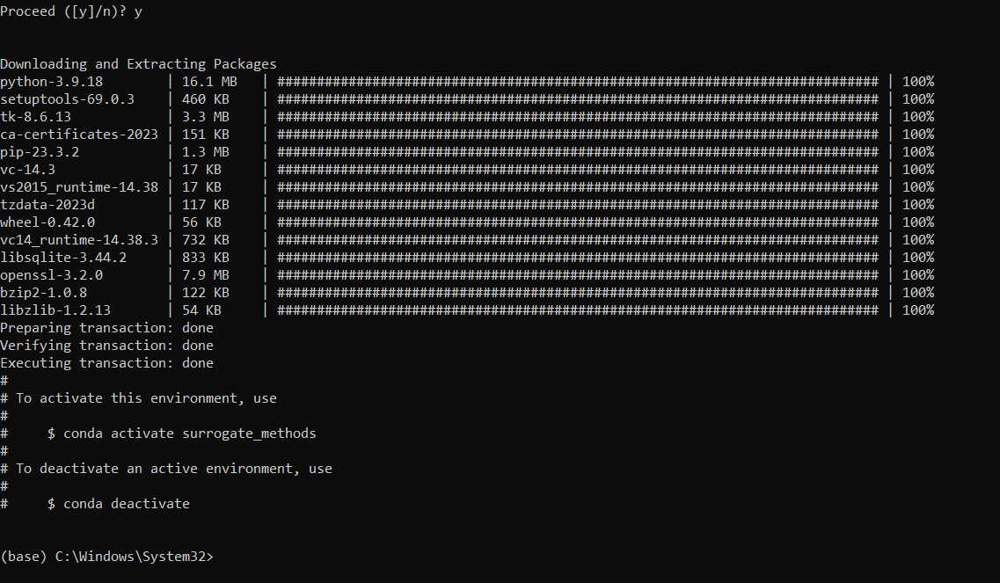
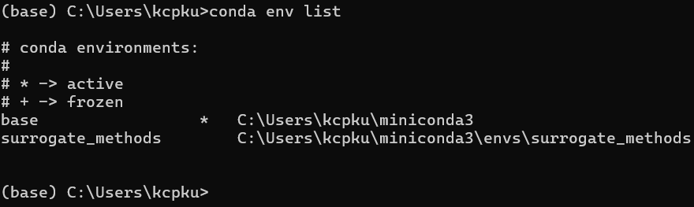
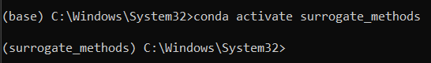
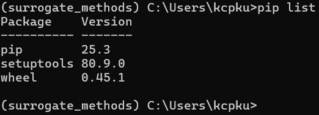

# Computing environment setup

The goal of this section is to create a computing environment on your computer to run and use the code given in the jupyter-book.
Follow below steps for setting up anaconda, creating an environment, and installing some initial
packages in the new environment. If you already have Anaconda or know any other method
which suits your needs in a better manner, then you are free to use that. **The end goal is to have
a working computing environment to use along with the jupyter-book**.

> **_NOTE:_** This guide assumes that you are using Windows OS. If you are using another OS, then the
steps will be very similar but there might be more usage of terminal commands.

## Step 1: Downloading and installing anaconda

You can skip this step if you already have Anaconda (or miniconda) installed.

1. Download anaconda from https://www.anaconda.com/download/success.

2. Open the installer and follow the instructions.

3. For “Installation Type”, you can select “All Users” if you are installing it on your PC.

4. In “Advanced Installation Options”, no need to change anything. Stick to default
selection.

Once installed, there are two ways to use Anaconda – ``Anaconda Prompt`` (a command line tool)
or ``Anaconda Navigator`` (GUI platform). Use whatever you are most comfortable with. To open
Anaconda Prompt or Navigator, simply search for it in the start menu. In this guide, Anaconda
Prompt will be used to demonstrate the creation of a computing environment. You can setup a
computing environment using Anaconda Navigator as well. Some useful tutorials for using the
Navigator can be found [here](https://docs.anaconda.com/navigator/tutorials/). It is highly recommend 
going through these tutorials if you choose to use Navigator to setup the environment.

Another alternative for creating a computing environment is to use miniconda which is a minimal
installation of Anaconda containing only conda, Python and a few other useful packages such as
pip. Instructions for installation of miniconda will not be covered in this guide and can be found [here](https://docs.conda.io/projects/miniconda/en/latest/). If you want to know more, there is also a 
comparison between Anaconda and miniconda given [here](https://docs.anaconda.com/distro-or-miniconda/). 
In general, it is recommended to use Anaconda if you are new to conda or Python. If
you have installed miniconda, it will also come with an Anaconda Prompt and a procedure like
the one outlined in the below steps can be used to set up the computing environment.

## Step 2: Creating a new environment

1. Open the Anaconda Prompt. Make sure that you use the run as administrator option
    when opening Anaconda Prompt. You will see a black screen with a command prompt.
    You will also see ``(base)`` written before the command prompt. When you installed
    anaconda, it created a base environment in which it installed several packages. By default,
    the base environment is activated when Anaconda is launched.

    

2. Type ``conda list`` and press enter to run this command. You will see the list of packages
    installed in the base environment.

    

    It is recommended to create a new environment for each project to avoid package
    dependency issues. To check the existing environments, you can run: ``conda env list``.

    

    It will show the list of environments and the active environment will have a “*” mark in
    front of it. If you just installed anaconda or never created an environment, then there will
    only be one environment called ``base``.

3. To create a new env, run the command: ``conda create -n ENVNAME python=3.9``. Replace
    ENVNAME with whatever name you want to give to the new environment. The
    ``python=3.9`` after the environment name tells conda what version of python to install.
    We will be using python version 3.9 in this book.

    

    Once the environment is successfully created, you will see the following in the command
    prompt on your screen.

    

    You can run conda env list again and see that your newly created environment is there. For the
    example shown below, the name of the environment was set to surrogate_methods.

    

4. To activate the newly created env, run ``conda activate ENVNAME``. Replace ENVNAME with
    your environment name. You will see that the ``(base)`` before the command
    prompt will change to the ``ENVNAME``.

    

    If you run ``conda list`` now, then it will show the list of installed packages in the newly
    created environment. Note that the number of packages will be very less when compared
    to the ``base`` environment. You will have to install the packages as and when needed.

## Step 3: Installing packages

In this step, you will install some basic packages which you will need during the first few lectures.
You will install many other packages as the semester progresses.

1. Open Anaconda Prompt. Again, make sure that you use the run as administrator option
    when opening Anaconda Prompt. Activate the environment which you created in the last
    step.

    > **_NOTE:_** ``pip`` will be the main installer we will be using in this class. We will not be using
    conda to install any package. conda is just used as an environment manager.

    After activating the environment, you can run ``pip list`` to see the packages installed using
    pip within the activated environment.

    

    > **_NOTE:_** It is okay if your list is not exactly same as above.

2. Install Numpy by running: ``pip install numpy==1.23.5``. The number at the end indicates specific
    version of the package which we want to install. After installing any package, always run ``pip list``
    and see if the package is listed there or not, also ensure that the version of the package is 
    same as mentioned in the install command.

3. Install SciPy by running: ``pip install scipy==1.13.1``.

4. Install Matplotlib by running: ``pip install matplotlib==3.9.1``.

5. Install Jupyter Notebook by running: ``pip install notebook==7.2.1``.

    > **_NOTE:_** This will install a lot of dependencies that are required for Jupyter Notebook. 
    
    Jupyter Notebook is a computing platform that will be used extensively in this class.

Now, your computing environment should be ready. In future, whenever you are asked to install
a new package, you should install it using pip within this environment only.
